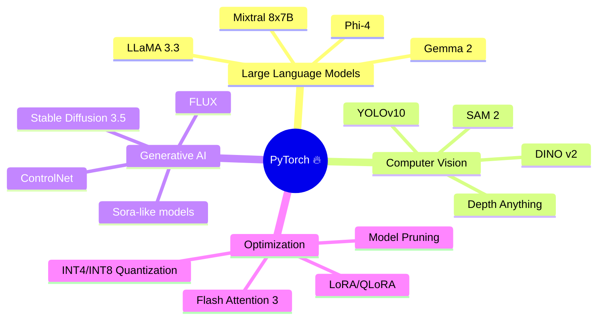

<div align="center">

# 🔥 PyTorch Teaching - Ultra Modern Learning Hub 🚀


### *Master Deep Learning with Style* ✨

[](https://github.com/umitkacar/Pytorch-Teaching/stargazers)
[](https://github.com/umitkacar/Pytorch-Teaching/network)
[](LICENSE)
[](https://pytorch.org/)
[](https://www.python.org/)

<p align="center">
  <a href="#-features">Features</a> •
  <a href="#-lessons">Lessons</a> •
  <a href="#-2024-2025-trending-resources">Trending Resources</a> •
  <a href="#-installation">Installation</a> •
  <a href="#-roadmap">Roadmap</a>
</p>

</div>

---

## 🌟 Features

<table>
<tr>
<td width="50%">

### 🎯 **Interactive Learning**
- 📓 Jupyter Notebook based tutorials
- 🎨 Visual explanations with code
- 💡 Real-world examples
- ⚡ Hands-on practice

</td>
<td width="50%">

### 🚀 **Modern Approach**
- 🔬 Latest PyTorch features (2024-2025)
- 🧠 AI/ML best practices
- 🏆 Industry-standard techniques
- 📊 Performance optimization tips

</td>
</tr>
</table>

---

## 📚 Lessons

### 🎓 **Core Curriculum**

<details open>
<summary><b>📖 Lesson 1: What is Tensor?</b></summary>
<br>

> **🎯 Learning Objectives:**
> - Understanding scalars, vectors, matrices, and tensors
> - Comparing Python, NumPy, and PyTorch implementations
> - Tensor creation and basic operations

```python
import torch
tensor = torch.tensor([[1, 2], [3, 4]])
print(tensor)
```

**📁 File:** `Pytorch-Lesson-1 (What is tensor?).ipynb`

</details>

<details open>
<summary><b>🧮 Lesson 2: Math Functions with Tensors</b></summary>
<br>

> **🎯 Learning Objectives:**
> - Tensor generation: `rand()`, `randn()`, `zeros()`, `ones()`
> - Mathematical operations: addition, multiplication, division
> - Tensor manipulation: `view()`, `reshape()`, `mean()`, `std()`
> - In-place vs standard operations

```python
# Element-wise operations
a = torch.rand(3, 3)
b = torch.rand(3, 3)
result = a * b  # Element-wise multiplication
```

**📁 File:** `Pytorch-Lesson-2 (Math Function with Tensor).ipynb`

</details>

<details open>
<summary><b>⚙️ Lesson 3: Convert Tensor & CPU-CUDA</b></summary>
<br>

> **🎯 Learning Objectives:**
> - Data type conversions (NumPy ↔ PyTorch ↔ Lists)
> - Memory management and sharing
> - CPU to GPU (CUDA) operations
> - Device management best practices

```python
# Move tensor to GPU
device = torch.device("cuda" if torch.cuda.is_available() else "cpu")
tensor = torch.tensor([1, 2, 3]).to(device)
```

**📁 File:** `Pytorch-Lesson-3 (Convert tensor and cpu-cuda).ipynb`

</details>

---

## 🔥 2024-2025 Trending Resources

### 🏆 **Must-Follow Repositories**

<table>
<tr>
<td align="center" width="33%">

#### 🤖 **Large Language Models**
[](https://github.com/meta-llama/llama3)
[](https://github.com/EleutherAI/gpt-neox)
[](https://github.com/huggingface/transformers)

</td>
<td align="center" width="33%">

#### 🎨 **Computer Vision**
[](https://github.com/THU-MIG/yolov10)
[](https://github.com/facebookresearch/segment-anything-2)
[](https://github.com/IDEA-Research/GroundingDINO)

</td>
<td align="center" width="33%">

#### 🚀 **Training & Optimization**
[](https://github.com/microsoft/DeepSpeed)
[](https://github.com/Dao-AILab/flash-attention)
[](https://github.com/OpenAccess-AI-Collective/axolotl)

</td>
</tr>
</table>

### 🌐 **Advanced PyTorch Frameworks (2024-2025)**

| Framework | Description | Stars | Use Case |
|-----------|-------------|-------|----------|
| 🔥 **[PyTorch Lightning](https://github.com/Lightning-AI/lightning)** | High-level PyTorch framework |  | Production-ready training |
| ⚡ **[TorchTune](https://github.com/pytorch/torchtune)** | Native PyTorch LLM fine-tuning |  | LLM fine-tuning |
| 🎯 **[Diffusers](https://github.com/huggingface/diffusers)** | State-of-the-art diffusion models |  | Image/Video generation |
| 🧠 **[Unsloth](https://github.com/unslothai/unsloth)** | 2x faster LLM training |  | Efficient fine-tuning |
| 🔬 **[torchao](https://github.com/pytorch/ao)** | PyTorch native quantization |  | Model optimization |
| 🎪 **[Torchvision](https://github.com/pytorch/vision)** | Computer vision library |  | Vision tasks |

### 🎓 **Learning Resources 2024-2025**

<div align="center">

| Resource | Type | Level | 🌟 Rating |
|----------|------|-------|-----------|
| **[Deep Learning with PyTorch](https://pytorch.org/tutorials/)** | Official Tutorials | Beginner-Advanced | ⭐⭐⭐⭐⭐ |
| **[Fast.ai Practical Deep Learning](https://course.fast.ai/)** | Course | Intermediate | ⭐⭐⭐⭐⭐ |
| **[d2l.ai - Dive into Deep Learning](https://d2l.ai/)** | Interactive Book | All Levels | ⭐⭐⭐⭐⭐ |
| **[PyTorch Recipes](https://pytorch.org/tutorials/recipes/recipes_index.html)** | Code Snippets | All Levels | ⭐⭐⭐⭐ |
| **[Papers with Code](https://paperswithcode.com/lib/pytorch)** | Research + Code | Advanced | ⭐⭐⭐⭐⭐ |

</div>

### 🎬 **Hot Topics 2024-2025**



---

## 🛠️ Installation

### **Quick Start** ⚡

```bash
# Clone the repository
git clone https://github.com/umitkacar/Pytorch-Teaching.git
cd Pytorch-Teaching

# Create virtual environment
python -m venv venv
source venv/bin/activate  # On Windows: venv\Scripts\activate

# Install PyTorch (CPU version)
pip install torch torchvision torchaudio

# Install PyTorch (GPU version - CUDA 12.1)
pip install torch torchvision torchaudio --index-url https://download.pytorch.org/whl/cu121

# Install additional dependencies
pip install jupyter matplotlib numpy pandas
```

### **Docker Setup** 🐳

```bash
# Pull official PyTorch image
docker pull pytorch/pytorch:2.5.0-cuda12.1-cudnn9-runtime

# Run Jupyter
docker run -it --gpus all -p 8888:8888 -v $(pwd):/workspace pytorch/pytorch:2.5.0-cuda12.1-cudnn9-runtime jupyter notebook --allow-root
```

---

## 🎯 Roadmap

```
✅ Lesson 1: Tensor Fundamentals
✅ Lesson 2: Math Operations
✅ Lesson 3: CPU/CUDA Conversion
🚧 Lesson 4: Neural Networks Basics (Coming Soon)
🚧 Lesson 5: Convolutional Neural Networks
🚧 Lesson 6: Recurrent Neural Networks
🚧 Lesson 7: Transformers & Attention
🚧 Lesson 8: Transfer Learning
🚧 Lesson 9: Generative Models
🚧 Lesson 10: Production Deployment
```

---

## 💻 System Requirements

<table>
<tr>
<td width="50%">

### **Minimum Requirements**
- 🖥️ **CPU:** Intel Core i5 or equivalent
- 🧠 **RAM:** 8 GB
- 💾 **Storage:** 5 GB free space
- 🐍 **Python:** 3.8+
- 📦 **PyTorch:** 2.0+

</td>
<td width="50%">

### **Recommended Requirements**
- 🖥️ **CPU:** Intel Core i7/AMD Ryzen 7
- 🧠 **RAM:** 16 GB+
- 🎮 **GPU:** NVIDIA RTX 3060+ (8GB VRAM)
- 💾 **Storage:** 20 GB SSD
- 🐍 **Python:** 3.10+
- 📦 **PyTorch:** 2.5+

</td>
</tr>
</table>

---

## 🤝 Contributing

We welcome contributions! 🎉

1. 🍴 Fork the repository
2. 🌿 Create your feature branch (`git checkout -b feature/AmazingFeature`)
3. 💾 Commit your changes (`git commit -m 'Add some AmazingFeature'`)
4. 📤 Push to the branch (`git push origin feature/AmazingFeature`)
5. 🎯 Open a Pull Request

---

## 📊 GitHub Stats

<div align="center">


</div>

---

## 📜 License

This project is licensed under the **MIT License** - see the [LICENSE](LICENSE) file for details.

---

## 🌟 Show Your Support

If you find this project helpful, please consider giving it a ⭐!

<div align="center">

### **Made with ❤️ for the PyTorch Community**

[](https://star-history.com/#umitkacar/Pytorch-Teaching&Date)

---

**Happy Learning! 🚀✨**


</div>
