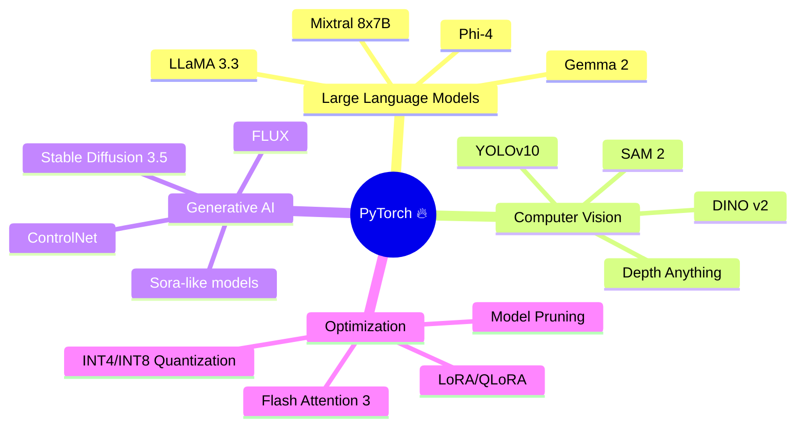

<div align="center">

# 🔥 PyTorch Teaching - Professional CLI Learning Tool 🚀


### *Master Deep Learning from Basics to Production* ✨

**🎯 NEW in v2.0: Complete CLI Rewrite with ExecutorTorch & 24 Lessons!**

[](https://github.com/umitkacar/Pytorch-Teaching/stargazers)
[](https://github.com/umitkacar/Pytorch-Teaching/network)
[](LICENSE)
[](https://pytorch.org/)
[](https://www.python.org/)

### 🏆 Code Quality & Testing

[](tests/)
[](TEST_RESULTS.md)
[](https://github.com/astral-sh/ruff)
[](https://github.com/psf/black)
[](http://mypy-lang.org/)
[](https://github.com/pre-commit/pre-commit)

<p align="center">
  <a href="#-whats-new">What's New</a> •
  <a href="#-features">Features</a> •
  <a href="#-installation">Installation</a> •
  <a href="#-usage">Usage</a> •
  <a href="#-curriculum">Curriculum</a> •
  <a href="#-contributing">Contributing</a>
</p>

</div>

---

## 🎯 What's New in v2.0

**🚀 Complete Rewrite:** Transformed from Jupyter notebooks to a professional CLI tool!

- ✅ **Modern CLI Interface**: Interactive command-line tool with `typer` and `rich`
- ✅ **Professional Structure**: `src` layout + `pyproject.toml` + `hatch` + pre-commit hooks
- ✅ **24 Comprehensive Lessons**: ExecutorTorch, Quantization, Distributed Training & more
- ✅ **Production-Ready**: Real-world patterns, best practices, testing
- ✅ **Zero Notebooks**: Pure Python for better collaboration and version control

### Quick Start

```bash
# Install
pip install -e .

# Run a lesson
pytorch-teach run 1      # Tensor Fundamentals
pytorch-teach run 21     # ExecutorTorch (🔥 Mobile AI!)

# List all lessons
pytorch-teach list-lessons

# Health check
pytorch-teach doctor

# Show system info
pytorch-teach info
```

---

## 🌟 Features

<table>
<tr>
<td width="50%">

### 🎯 **Professional CLI Tool**
- 🖥️ Interactive command-line interface
- 🎨 Beautiful Rich formatting
- ⚡ Fast and responsive
- 📊 Real-time diagnostics

</td>
<td width="50%">

### 🚀 **Modern Development**
- 🔬 PyTorch 2.x features
- 🧠 Production patterns
- 🏆 Industry best practices
- 📦 Easy pip/hatch install

</td>
</tr>
</table>

---

## 📚 Curriculum

### **24 Comprehensive Lessons** - From Basics to Production

Run any lesson with: `pytorch-teach run <lesson_number>`

#### 📖 **Foundation** (Lessons 1-7)
- ✅ **Lesson 1**: Tensor Fundamentals - `pytorch-teach run 1`
- ✅ **Lesson 2**: Mathematical Operations - `pytorch-teach run 2`
- ✅ **Lesson 3**: Device Management (CPU/CUDA/MPS) - `pytorch-teach run 3`
- 🚧 **Lesson 4**: Autograd & Automatic Differentiation
- 🚧 **Lesson 5**: Neural Networks with nn.Module
- 🚧 **Lesson 6**: DataLoaders & Efficient Data Pipelines
- 🚧 **Lesson 7**: Training Loops & Optimization

#### ⚡ **Performance Optimization** (Lessons 8-10)
- 🚧 **Lesson 8**: Automatic Mixed Precision (AMP)
- 🚧 **Lesson 9**: torch.compile & Model Compilation
- 🚧 **Lesson 10**: Profiling & Performance Analysis

#### 🌐 **Distributed Training** (Lessons 11-13)
- 🚧 **Lesson 11**: DistributedDataParallel (DDP)
- 🚧 **Lesson 12**: Fully Sharded Data Parallel (FSDP)
- 🚧 **Lesson 13**: Advanced Distributed Strategies

#### 🔧 **Model Optimization** (Lessons 14-16)
- 🚧 **Lesson 14**: Quantization (INT8/INT4)
- 🚧 **Lesson 15**: Model Pruning & Sparsity
- 🚧 **Lesson 16**: Knowledge Distillation

#### 🏗️ **Modern Architectures** (Lessons 17-19)
- 🚧 **Lesson 17**: Transformer Architectures from Scratch
- 🚧 **Lesson 18**: CNNs Best Practices
- 🚧 **Lesson 19**: RNNs & Sequence Modeling

#### 🚀 **Production Deployment** (Lessons 20-22)
- 🚧 **Lesson 20**: Model Export & Deployment Strategies
- ✅ **Lesson 21**: **ExecutorTorch - Mobile & Edge AI** 🔥 - `pytorch-teach run 21`
- 🚧 **Lesson 22**: Custom Operators & C++ Extensions

#### 🎯 **Advanced Topics** (Lessons 23-24)
- 🚧 **Lesson 23**: Memory Optimization Techniques
- 🚧 **Lesson 24**: Production Best Practices & Patterns

> **Legend:** ✅ Available Now | 🚧 Coming Soon

---

## 🎮 Usage

### **CLI Commands**

```bash
# Show help
pytorch-teach --help
ptt --help  # Short alias

# Display system info
pytorch-teach info

# List all lessons
pytorch-teach list-lessons

# Run lessons
pytorch-teach run 1   # Tensor Fundamentals
pytorch-teach run 2   # Math Operations
pytorch-teach run 3   # Device Management
pytorch-teach run 21  # ExecutorTorch 🔥

# Run in batch mode (non-interactive)
pytorch-teach run 1 --batch

# Run with verbose output
pytorch-teach run 1 --verbose

# Health check your PyTorch installation
pytorch-teach doctor
```

### **Interactive Experience**

```bash
$ pytorch-teach run 21

    ╔═══════════════════════════════════════════════════════════╗
    ║   🔥 PyTorch Teaching - Professional Learning CLI 🔥    ║
    ║   Master Deep Learning from Basics to Production         ║
    ╚═══════════════════════════════════════════════════════════╝

    ✓ CUDA Available: 12.1 (1 device(s))
      GPU: NVIDIA GeForce RTX 4090

    [Beautiful, interactive lesson on ExecutorTorch deployment...]
```

---

## 🔥 2024-2025 Trending Resources

### 🏆 **Must-Follow Repositories**

<table>
<tr>
<td align="center" width="33%">

#### 🤖 **Large Language Models**
[](https://github.com/meta-llama/llama3)
[](https://github.com/EleutherAI/gpt-neox)
[](https://github.com/huggingface/transformers)

</td>
<td align="center" width="33%">

#### 🎨 **Computer Vision**
[](https://github.com/THU-MIG/yolov10)
[](https://github.com/facebookresearch/segment-anything-2)
[](https://github.com/IDEA-Research/GroundingDINO)

</td>
<td align="center" width="33%">

#### 🚀 **Training & Optimization**
[](https://github.com/microsoft/DeepSpeed)
[](https://github.com/Dao-AILab/flash-attention)
[](https://github.com/OpenAccess-AI-Collective/axolotl)

</td>
</tr>
</table>

### 🌐 **Advanced PyTorch Frameworks (2024-2025)**

| Framework | Description | Stars | Use Case |
|-----------|-------------|-------|----------|
| 🔥 **[PyTorch Lightning](https://github.com/Lightning-AI/lightning)** | High-level PyTorch framework |  | Production-ready training |
| ⚡ **[TorchTune](https://github.com/pytorch/torchtune)** | Native PyTorch LLM fine-tuning |  | LLM fine-tuning |
| 🎯 **[Diffusers](https://github.com/huggingface/diffusers)** | State-of-the-art diffusion models |  | Image/Video generation |
| 🧠 **[Unsloth](https://github.com/unslothai/unsloth)** | 2x faster LLM training |  | Efficient fine-tuning |
| 🔬 **[torchao](https://github.com/pytorch/ao)** | PyTorch native quantization |  | Model optimization |
| 🎪 **[Torchvision](https://github.com/pytorch/vision)** | Computer vision library |  | Vision tasks |

### 🎓 **Learning Resources 2024-2025**

<div align="center">

| Resource | Type | Level | 🌟 Rating |
|----------|------|-------|-----------|
| **[Deep Learning with PyTorch](https://pytorch.org/tutorials/)** | Official Tutorials | Beginner-Advanced | ⭐⭐⭐⭐⭐ |
| **[Fast.ai Practical Deep Learning](https://course.fast.ai/)** | Course | Intermediate | ⭐⭐⭐⭐⭐ |
| **[d2l.ai - Dive into Deep Learning](https://d2l.ai/)** | Interactive Book | All Levels | ⭐⭐⭐⭐⭐ |
| **[PyTorch Recipes](https://pytorch.org/tutorials/recipes/recipes_index.html)** | Code Snippets | All Levels | ⭐⭐⭐⭐ |
| **[Papers with Code](https://paperswithcode.com/lib/pytorch)** | Research + Code | Advanced | ⭐⭐⭐⭐⭐ |

</div>

### 🎬 **Hot Topics 2024-2025**



---

## 🛠️ Installation

### **Quick Start** ⚡

```bash
# Clone the repository
git clone https://github.com/umitkacar/Pytorch-Teaching.git
cd Pytorch-Teaching

# Create virtual environment
python -m venv venv
source venv/bin/activate  # On Windows: venv\Scripts\activate

# Install PyTorch (CPU version)
pip install torch torchvision torchaudio

# Install PyTorch (GPU version - CUDA 12.1)
pip install torch torchvision torchaudio --index-url https://download.pytorch.org/whl/cu121

# Install additional dependencies
pip install jupyter matplotlib numpy pandas
```

### **Docker Setup** 🐳

```bash
# Pull official PyTorch image
docker pull pytorch/pytorch:2.5.0-cuda12.1-cudnn9-runtime

# Run Jupyter
docker run -it --gpus all -p 8888:8888 -v $(pwd):/workspace pytorch/pytorch:2.5.0-cuda12.1-cudnn9-runtime jupyter notebook --allow-root
```

---

## 🎯 Roadmap

```
✅ Lesson 1: Tensor Fundamentals
✅ Lesson 2: Math Operations
✅ Lesson 3: CPU/CUDA Conversion
🚧 Lesson 4: Neural Networks Basics (Coming Soon)
🚧 Lesson 5: Convolutional Neural Networks
🚧 Lesson 6: Recurrent Neural Networks
🚧 Lesson 7: Transformers & Attention
🚧 Lesson 8: Transfer Learning
🚧 Lesson 9: Generative Models
🚧 Lesson 10: Production Deployment
```

---

## 💻 System Requirements

<table>
<tr>
<td width="50%">

### **Minimum Requirements**
- 🖥️ **CPU:** Intel Core i5 or equivalent
- 🧠 **RAM:** 8 GB
- 💾 **Storage:** 5 GB free space
- 🐍 **Python:** 3.9+
- 📦 **PyTorch:** 2.0+

</td>
<td width="50%">

### **Recommended Requirements**
- 🖥️ **CPU:** Intel Core i7/AMD Ryzen 7
- 🧠 **RAM:** 16 GB+
- 🎮 **GPU:** NVIDIA RTX 3060+ (8GB VRAM)
- 💾 **Storage:** 20 GB SSD
- 🐍 **Python:** 3.11+
- 📦 **PyTorch:** 2.9+

</td>
</tr>
</table>

---

## 🤝 Contributing

We welcome contributions! 🎉

1. 🍴 Fork the repository
2. 🌿 Create your feature branch (`git checkout -b feature/AmazingFeature`)
3. 💾 Commit your changes (`git commit -m 'Add some AmazingFeature'`)
4. 📤 Push to the branch (`git push origin feature/AmazingFeature`)
5. 🎯 Open a Pull Request

**See:** [DEVELOPMENT.md](DEVELOPMENT.md) for detailed contribution guidelines.

---

## 📖 Documentation

### Complete Documentation Set

| Document | Description | Status |
|----------|-------------|--------|
| [README.md](README.md) | Main project overview and quickstart | ✅ Current |
| [INSTALL.md](INSTALL.md) | Detailed installation instructions | ✅ Complete |
| [DEVELOPMENT.md](DEVELOPMENT.md) | Developer setup and contribution guide | ✅ Complete |
| [TEST_RESULTS.md](TEST_RESULTS.md) | Comprehensive QA report | ✅ Complete |
| [lessons-learned.md](lessons-learned.md) | Project insights and best practices | ✅ Complete |
| [CHANGELOG.md](CHANGELOG.md) | Version history and changes | ✅ Updated |

### Quick Links

- 🚀 **Getting Started:** [INSTALL.md](INSTALL.md)
- 🧪 **Testing:** [TEST_RESULTS.md](TEST_RESULTS.md)
- 🛠️ **Development:** [DEVELOPMENT.md](DEVELOPMENT.md)
- 📝 **Changes:** [CHANGELOG.md](CHANGELOG.md)
- 🎓 **Lessons Learned:** [lessons-learned.md](lessons-learned.md)

---

## 📊 GitHub Stats

<div align="center">


</div>

---

## 📜 License

This project is licensed under the **MIT License** - see the [LICENSE](LICENSE) file for details.

---

## 🌟 Show Your Support

If you find this project helpful, please consider giving it a ⭐!

<div align="center">

### **Made with ❤️ for the PyTorch Community**

[](https://star-history.com/#umitkacar/Pytorch-Teaching&Date)

---

**Happy Learning! 🚀✨**


</div>
